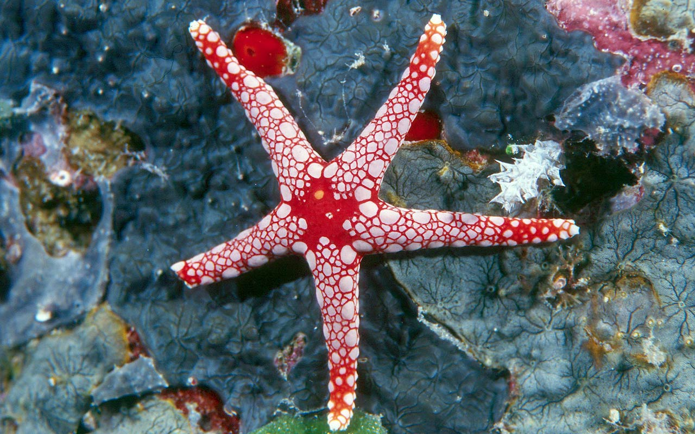

Seastar project documenation
============================

This is where the description for the project goes ...

Requirements
************

xarray, scipy, numpy

.. toctree::
   :maxdepth: 3
   :caption: Contents:
   
   getting_started
   code

Indices and tables
==================

* :ref:`genindex`
* :ref:`modindex`
* :ref:`search`
